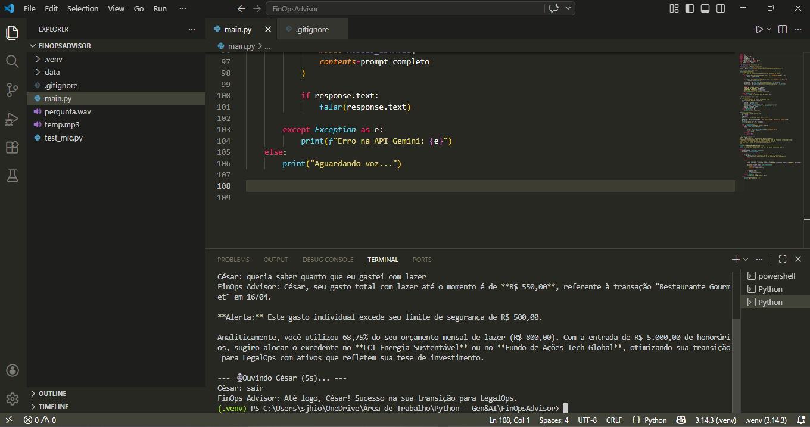

# Assets

### 🖥️ Demonstração em Tempo Real

Aqui está um registro do **FinOps Advisor** em ação, realizando a análise proativa de um gasto elevado diretamente no terminal do VS Code:

> Note no terminal como o agente identifica o gasto de R$ 550,00 e emite o alerta automático sobre o teto ético de R$ 500,00.

