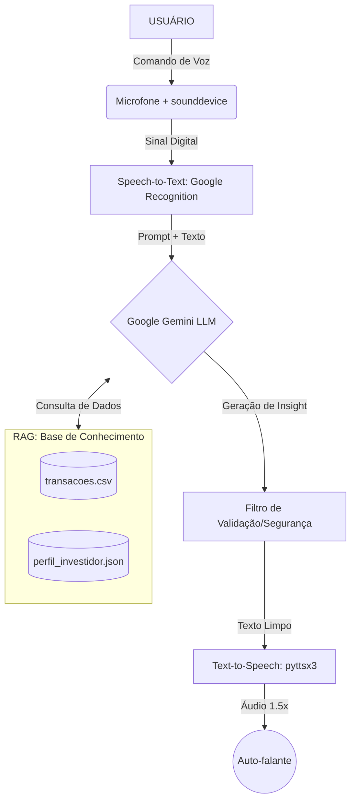

# Documentação do Agente

## Caso de Uso

### Problema
> Qual problema financeiro seu agente resolve?

Profissionais de áreas críticas (como Direito e Finanças) perdem tempo navegando em dashboards complexos para obter métricas simples. A latência entre a necessidade da informação e a consulta manual reduz a produtividade.

### Solução
> Como o agente resolve esse problema de forma proativa?

Um agente de voz proativo que utiliza RAG (Retrieval-Augmented Generation) para consultar bases de dados financeiras (.csv e .json) e entregar insights instantâneos por voz acelerada (1.5x), antecipando alertas de orçamento.

### Público-Alvo
> Quem vai usar esse agente?

Advogados, gestores de LegalOps e investidores que necessitam de consulta de dados hands-free durante a rotina de trabalho.

---

## Persona e Tom de Voz

### Nome do Agente
FinOps Advisor

### Personalidade
> Como o agente se comporta? (ex: consultivo, direto, educativo)

Consultivo, analítico e focado em conformidade. Comporta-se como um Controller Sênior.

### Tom de Comunicação
> Formal, informal, técnico, acessível?

Executivo e direto. Evita redundâncias para otimizar a experiência de áudio.

### Exemplos de Linguagem
- Saudação: "Olá! Sou seu Advisor. Sistema pronto para consulta de dados financeiros e perfil."
- Confirmação: "Entendido. Acessando sua base de transações agora."
- Erro/Limitação: "Esta informação não consta na base de dados fornecida. Por segurança, prefiro não especular sobre esse valor."

---

## Arquitetura

### Diagrama

### Componentes

| Componente | Descrição |
|------------|-----------|
| Interface | Terminal Python com captação de áudio via sounddevice. |
| LLM | Google Gemini API (modelo gemini-flash-latest). |
| Base de Conhecimento | Arquivos transacoes.csv e perfil_investidor.json (Dados Mockados). |
| Validação | Verificação de Grounding via System Prompt para evitar alucinações. |

---

## Segurança e Anti-Alucinação

### Estratégias Adotadas

- [ ] Restrição de Escopo: O agente é instruído via System Prompt a responder apenas com base nos dados do repositório local.
- [ ] Admissão de Falha: Configurado para admitir quando um dado não está presente, redirecionando o usuário para o suporte humano ou canais oficiais.
- [ ] Verificação de Perfil: O agente cruza a categoria da transação com o perfil_investidor.json antes de validar se um gasto é "adequado" ou não.

### Limitações Declaradas
> O que o agente NÃO faz?

- O agente NÃO realiza transferências bancárias ou movimentações financeiras reais.
- O agente NÃO faz recomendações de ativos de risco sem antes validar a política de tolerância no perfil do cliente.
- O agente NÃO armazena chaves de API ou senhas do usuário no código-fonte (Segurança de Credenciais).

